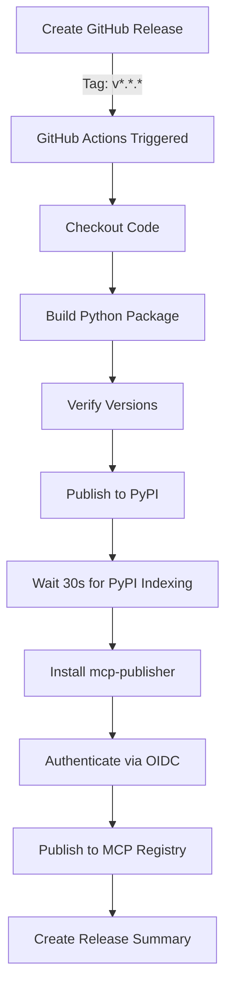

# Publishing Automation - WeMo MCP Server

## Overview

As of v1.1.1+, the WeMo MCP Server uses **fully automated publishing** for both PyPI and MCP Registry releases via GitHub Actions.

When you create a GitHub release, one workflow handles everything:
- ✅ Builds and publishes to PyPI (using trusted publishing/OIDC)
- ✅ Publishes to MCP Registry (using GitHub OIDC authentication)
- ✅ Verifies version consistency
- ✅ Creates detailed release summary

## How It Works

### Workflow File
`.github/workflows/pypi-publish.yml`

### Trigger
- **Automatic**: When you publish a GitHub release with tag format `v*.*.*` (e.g., `v1.2.0`)
- **Manual**: Can be triggered via workflow_dispatch for testing

### Authentication
Both services use **OIDC (OpenID Connect)** trusted publishing:
- **PyPI**: Pre-configured trusted publisher at https://pypi.org/manage/account/publishing/
- **MCP Registry**: Uses `mcp-publisher login github-oidc` during workflow

### Process Flow



## Release Workflow Steps

### 1. Preparation (Local)
```bash
# Update version in both files
vim pyproject.toml              # Line 7: version = "1.2.0"
vim src/wemo_mcp_server/__init__.py  # Line 3: __version__ = "1.2.0"
vim server.json                 # Line 10: "version": "1.2.0"

# Update CHANGELOG.md
vim CHANGELOG.md

# Commit and push
git add pyproject.toml src/wemo_mcp_server/__init__.py server.json CHANGELOG.md
git commit -m "Release v1.2.0"
git push origin main
```

### 2. Create Release (GitHub)
```bash
# Create and push tag
git tag v1.2.0
git push origin v1.2.0

# Or via GitHub UI:
# https://github.com/apiarya/wemo-mcp-server/releases/new
```

### 3. Automation Runs (GitHub Actions)
The workflow automatically:

1. **Version Verification**
   - Checks `pyproject.toml` matches git tag
   - Checks `server.json` matches git tag
   - Fails if any mismatch found

2. **PyPI Publishing**
   - Builds source distribution and wheel
   - Validates package with twine
   - Publishes using PyPI trusted publishing (OIDC)
   - No API tokens needed!

3. **MCP Registry Publishing**
   - Waits 30 seconds for PyPI to index new version
   - Downloads and installs mcp-publisher CLI
   - Authenticates using GitHub OIDC (`github-oidc` method)
   - Publishes `server.json` to registry
   - Registry validates PyPI package exists

4. **Release Summary**
   - Creates formatted summary in GitHub Actions
   - Includes links to PyPI and MCP Registry
   - Shows install commands

### 4. Verification (Automatic)
Monitor at: https://github.com/apiarya/wemo-mcp-server/actions

Expected results:
- ✅ All workflow steps pass (green checkmarks)
- ✅ Package appears on PyPI: https://pypi.org/project/wemo-mcp-server/
- ✅ Server appears in MCP Registry: https://registry.modelcontextprotocol.io/?q=apiarya/wemo
- ✅ Summary shows both publications successful

## Permissions Required

### GitHub Repository Settings
File: `.github/workflows/pypi-publish.yml`

```yaml
permissions:
  contents: read      # Read repository contents
  id-token: write     # Generate OIDC tokens for PyPI and MCP Registry
```

### PyPI Trusted Publisher
Pre-configured at: https://pypi.org/manage/account/publishing/

Settings:
- **Project**: wemo-mcp-server
- **Repository**: apiarya/wemo-mcp-server
- **Workflow**: pypi-publish.yml
- **Environment**: (Any)

### MCP Registry Authentication
Handled automatically via `mcp-publisher login github-oidc` during workflow.

No pre-configuration needed - GitHub OIDC tokens are validated by the registry.

## Troubleshooting

### Workflow Doesn't Trigger
- **Check tag format**: Must be `v*.*.*` (e.g., `v1.2.0`)
- **Check release status**: Must be "published" (not draft)
- **Check Actions tab**: https://github.com/apiarya/wemo-mcp-server/actions

### PyPI Publishing Fails
- **Version mismatch**: Ensure tag matches `pyproject.toml`
- **Version already exists**: PyPI doesn't allow re-uploading same version
- **Trusted publisher misconfigured**: Check https://pypi.org/manage/account/publishing/

### MCP Registry Publishing Fails
- **PyPI not indexed yet**: Workflow waits 30s, but might need longer
- **Version mismatch**: Ensure tag matches `server.json`
- **PyPI package doesn't exist**: Registry validates package exists on PyPI

### Manual Publishing (Fallback)

If automation fails, you can manually publish:

#### PyPI
```bash
# Build locally
python -m build

# Upload (requires API token)
twine upload dist/*
```

#### MCP Registry
```bash
# Install CLI
brew install mcp-publisher

# Authenticate
mcp-publisher login github

# Publish
mcp-publisher publish server.json
```

## Security Benefits

### Trusted Publishing (OIDC)
- ✅ **No long-lived tokens** - OIDC tokens expire in minutes
- ✅ **No secrets in GitHub** - No `PYPI_API_TOKEN` or registry tokens needed
- ✅ **Scoped access** - Tokens only valid for specific repository and workflow
- ✅ **Audit trail** - All publishes linked to specific GitHub Actions runs
- ✅ **Automatic rotation** - New token generated for each workflow run

### vs. Traditional API Tokens
| Feature | OIDC/Trusted Publishing | API Tokens |
|---------|------------------------|------------|
| Token Lifetime | Minutes | Years (until revoked) |
| Storage Location | None (generated on-demand) | GitHub Secrets |
| Scope | Specific repo + workflow | Entire account or project |
| Compromise Risk | Minimal (short-lived) | High (if leaked) |
| Rotation | Automatic | Manual |

## Benefits

### For Maintainers
- 🚀 **Faster releases** - One click (GitHub release) publishes everywhere
- 🔒 **More secure** - No API tokens to manage or leak
- 📊 **Better visibility** - All publishing steps in one workflow with summary
- ✅ **Automatic validation** - Version consistency checked automatically
- 📝 **Audit trail** - Every release tracked in GitHub Actions

### For Users
- 🔄 **Synchronized releases** - PyPI and MCP Registry always match
- 🎯 **No confusion** - Same version number everywhere
- 🚀 **Faster availability** - Published within minutes of release
- 📚 **Clear documentation** - Release notes in one place

## Workflow Performance

Typical publishing time: **2-3 minutes**

Breakdown:
- Checkout & setup: ~30s
- Build package: ~20s
- Publish to PyPI: ~30s
- Wait for PyPI indexing: 30s
- Install mcp-publisher: ~15s
- Publish to MCP Registry: ~20s
- Generate summary: ~5s

## Example Release Summary

After successful workflow run, you'll see:

```markdown
## 🎉 Published Successfully

**Version:** 1.2.0

### 📦 PyPI

**Install command:**
```bash
pip install wemo-mcp-server==1.2.0
# or
uvx wemo-mcp-server@1.2.0
```

**PyPI page:** https://pypi.org/project/wemo-mcp-server/1.2.0/

### 🌐 MCP Registry

**Registry page:** https://registry.modelcontextprotocol.io/?q=apiarya/wemo
**Server name:** `io.github.apiarya/wemo`

---

**Repository:** https://github.com/apiarya/wemo-mcp-server
```

## Future Enhancements

Possible improvements:
- 🧪 Add smoke tests after publishing
- 📢 Automatic announcements (Discord, Twitter, etc.)
- 📊 Download statistics reporting
- 🔔 Notification on publish failure
- 🏷️ Automatic changelog generation

## References

- [PyPI Trusted Publishing](https://docs.pypi.org/trusted-publishers/)
- [GitHub Actions OIDC](https://docs.github.com/en/actions/deployment/security-hardening-your-deployments/about-security-hardening-with-openid-connect)
- [MCP Registry Documentation](https://github.com/modelcontextprotocol/registry)
- [mcp-publisher CLI](https://github.com/modelcontextprotocol/registry/tree/main/cli)

---

**Questions or Issues?**
Open an issue: https://github.com/apiarya/wemo-mcp-server/issues
